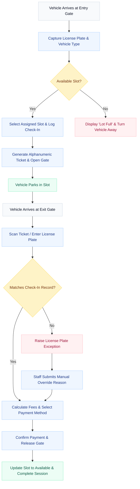
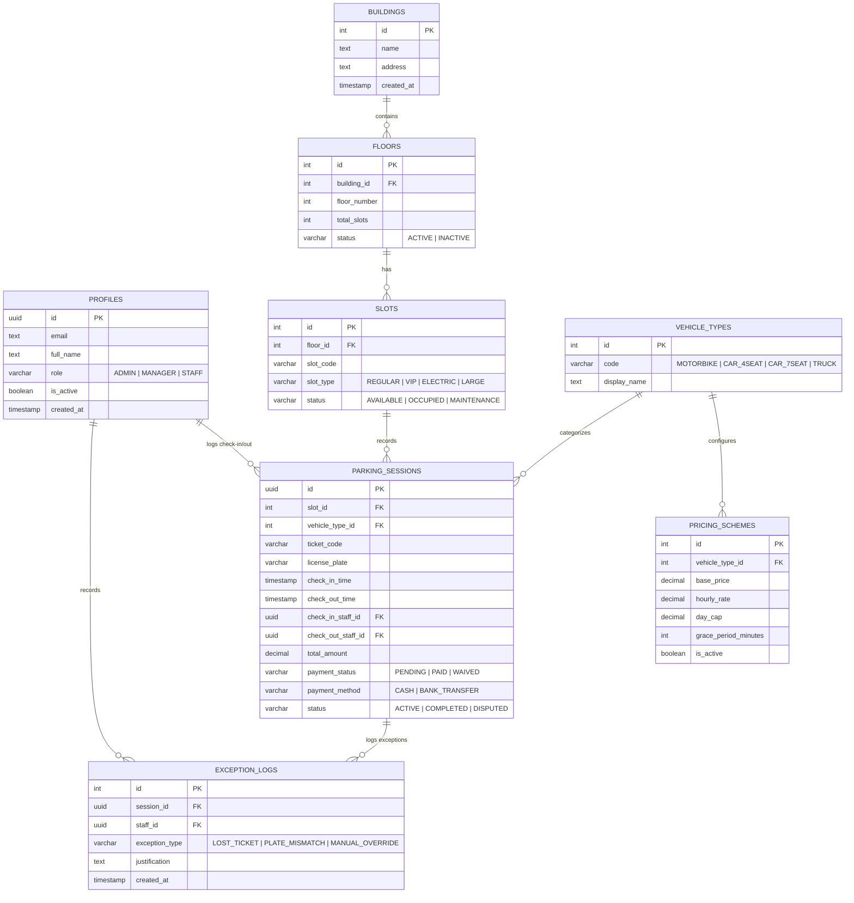

# Software Requirements Specification (SRS)
## Project: Parking Building Management System (PBMS)
**Version:** 1.0.0  
**Target Audience:** Development Team, Capstone Project Assessors, System Operators  
**UI/UX Aesthetic Direction:** Shadcn UI (Admin Dashboard Style - Sidebar, Cards, Tables, Clean Spacing, Light Professional Theme)

---

## 1. System Overview
The **Parking Building Management System (PBMS)** is a dedicated internal operations platform designed for managing multi-story parking structures. It aims to streamline vehicle entry/exit operations, optimize space utilization, secure revenue collection, and provide managers with actionable insights.

Unlike customer-facing parking applications, PBMS focuses **exclusively** on internal operator controls, gate operations, and administrative functions. It eliminates reservation modules and customer-facing portals to focus on a high-throughput, reliable desktop/tablet interface for staff and managers on site.

---

## 2. Business Goals
*   **Prevent Revenue Leakage:** Automate fee calculations based on configurable pricing matrices and log all exit exceptions (e.g., manual overrides, ticket bypasses).
*   **Maximize Space Efficiency:** Provide real-time occupancy monitoring and optimization to minimize empty slots and guide staff dynamically.
*   **Accelerate Gate Throughput:** Speed up check-in and check-out processing times using streamlined UI inputs, reducing vehicle queues at entrance/exit gates.
*   **Establish Operational Accountability:** Maintain a comprehensive, immutable audit trail for all staff actions, gate overrides, and financial transactions.
*   **Data-Driven Decision Making:** Equip managers with real-time operational metrics, peak-hour occupancy analytics, and revenue breakdown reports.

---

## 3. Roles and Responsibilities

The system strictly enforces **Role-Based Access Control (RBAC)** across three distinct roles:

| Role | Core Responsibilities | Key System Permissions |
| :--- | :--- | :--- |
| **Admin** | System configuration, infrastructure setup, and user provisioning. | - Manage user accounts (Staff, Managers).<br>- Create and configure Parking Buildings & Floors.<br>- Set up master system constants (e.g., currency, default configurations). |
| **Manager** | Operational optimization, pricing configuration, audit, and reporting. | - Configure dynamic pricing tariffs and rules.<br>- Monitor live parking operations and slot occupancies.<br>- Review exception logs and authorize manual override approvals.<br>- Generate and export financial, occupancy, and audit reports. |
| **Staff** | Gate operations, immediate exception handling, and floor monitoring. | - Check-in vehicles (manual input / camera capture simulation).<br>- Check-out vehicles (calculate fees, verify license plates, process payment status).<br>- Request exception bypasses (lost ticket, plate mismatch).<br>- Update slot statuses (e.g., mark slot as under maintenance). |

---

## 4. Functional Requirements by Module

### 4.1 Authentication & User Management
*   **Secure Authentication:** User login using verified email and password credentials via Supabase Auth.
*   **Session Lifetime:** Automated session timeouts after 30 minutes of inactivity to protect terminals.
*   **Role Enforcement:** Server-side and client-side route protection. Redirect users to their respective dashboards upon login:
    *   *Admin* -> User Management / Global Configuration.
    *   *Manager* -> Operations Dashboard / Reports.
    *   *Staff* -> Gate Control Console.
*   **User Management (Admin Only):** Create, update, suspend, and view audit histories for Manager and Staff accounts.

### 4.2 Floor & Slot Management
*   **Visual Occupancy Layout:** A color-coded interactive grid representing parking slots grouped by floor:
    *   🟢 *Available* (Ready for allocation)
    *   🔴 *Occupied* (Currently contains a vehicle)
    *   🟡 *Maintenance* (Out of service)
    *   🔵 *Reserved/VIP* (Restricted slots)
*   **Slot Details Inspector:** Click on any occupied slot to view the current vehicle's license plate, check-in time, elapsed duration, and slot code.
*   **Slot Configurations:** Create, edit, or delete slots and assign classifications (Regular, VIP, Electric, Large).
*   **Status Toggles:** Staff or Managers can mark slots as "Maintenance" to remove them from active vehicle routing.

### 4.3 Vehicle Entry (Check-In)
*   **Check-In Interface:** A simple, high-throughput form for entry gate Staff.
*   **Plate & Vehicle Registration:** Capture license plate details (manually or via LPR camera simulation) and select the vehicle category (e.g., Sedan, SUV, Motorbike, Truck).
*   **Auto-Allocation:** System auto-suggests the closest available slot based on vehicle type and floor priority.
*   **Session Initiation:** Creates a `ParkingSession` record with a `Pending` checkout status, logs the check-in timestamp and staff ID, and marks the slot as `Occupied`.
*   **Ticket Issuance:** Generates and displays a unique, short alphanumeric ticket code (e.g., `TKT-A8B9`) for printing.

### 4.4 Vehicle Exit (Check-Out) & Payment
*   **Check-Out lookup:** Search active parking sessions by scanning/entering the ticket code or typing the license plate.
*   **Fee Engine:** Instantly calculate elapsed time and total fee based on active pricing rules (including vehicle-type multipliers and grace periods).
*   **Payment Gateway Interface:** Staff records the payment method (Cash, Bank Transfer/QR Code) and confirms payment success.
*   **Session Completion:** Upon payment verification, the system marks the slot as `Available`, sets the session status to `Completed`, and releases the exit gate (simulated).

### 4.5 Pricing & Tariffs Management
*   **Base Pricing Grid:** Configure standard hourly fees per vehicle type.
*   **Advanced Tariff Engine (Manager Only):** 
    *   Define grace periods (e.g., first 10 minutes free).
    *   Define day-rate caps (maximum charge per 24 hours).
    *   Set surcharges for night hours (e.g., 22:00 to 05:00) or weekends.
*   **Tariff Selection:** When calculating checkout fees, the system automatically applies the tariff rules active during the session duration.

### 4.6 Dashboard & Reporting
*   **Key Performance Indicators (KPIs):** Real-time summary cards displaying:
    *   Total Occupancy Rate (%)
    *   Active Vehicles Count
    *   Today's Collected Revenue
    *   Active Gate Exceptions
*   **Data Visualizations:** 
    *   *Occupancy Trend:* Line chart displaying occupancy levels hourly or daily.
    *   *Revenue Breakdown:* Bar chart showing earnings by vehicle type.
    *   *Floor Distribution:* Stacked charts showing space utilization per floor.
*   **Reporting Grid:** A sortable, filterable table listing historical parking sessions. Filters include date range, vehicle type, payment status, and checkout staff.
*   **Data Export:** Download filtered report data in CSV format.

### 4.7 Exceptions & Audit Logs
*   **Gate Exceptions:** Automatically flags anomalies during checkout:
    *   *License Plate Mismatch:* Exit plate differs from check-in plate.
    *   *Lost Ticket:* Ticket code is missing or unreadable.
*   **Manual Gate Override:** Allows staff to manually force-open a gate or bypass a fee.
*   **Audit Archiving:** Requires the operator to enter a mandatory override justification. Captures the staff ID, timestamp, and exception details, placing them in an immutable audit log.

---

## 5. Non-Functional Requirements

### 5.1 Performance
*   **Transaction Latency:** Core operations (gate lookups, session creations) must return in less than 500ms under standard loads.
*   **Real-time Synchronization:** Slot status changes must reflect on dashboard maps in under 1 second via web sockets (Supabase Realtime).
*   **UI Snappiness:** Interactive tables and visual grids must implement pagination or virtualized lists to handle up to 10,000 logs smoothly.

### 5.2 Security
*   **Role Isolation (RBAC):** Row-Level Security (RLS) enabled on Supabase PostgreSQL. Staff credentials must be barred from performing deletion queries or accessing report aggregate tables.
*   **Secure API Communication:** All communications must run over HTTPS. API keys and passwords must not be stored in insecure client-side states.
*   **Immutable Logging:** The `ExceptionLogs` and `AuditLogs` tables must not have `UPDATE` or `DELETE` permissions enabled for non-admin accounts.

### 5.3 Reliability & Fault Tolerance
*   **Keyboard-First Gate Control:** The entry/exit screens must support full keyboard navigation (Tab, Enter, Escape shortcuts) so staff can operate when mouse peripherals fail.
*   **Append-Only Transaction Records:** Sessions and exceptions must never be hard-deleted, ensuring full operational trace history.

### 5.4 Usability & Aesthetics
*   **Shadcn UI Theme:** Clean, modern, light-themed admin dashboard utilizing a structured grid, slate borders (`border-slate-200`), clear font styling (Inter/Outfit), and rounded corners.
*   **Color Semantics:** Strictly use green for available/success, red/rose for occupied/danger, amber for warnings, and slate/indigo for brand neutrals.
*   **Sidebar Navigation:** Role-restricted sidebar with clean iconography (Lucide Icons).

---

## 6. Main Business Flows



### 6.1 Authentication & Login Flow
1.  **Input:** User enters email and password into the login interface.
2.  **Validation:** Frontend checks basic email structure and sends request to `supabase.auth.signInWithPassword()`.
3.  **Role Retrieval:** Upon successful authentication, the frontend queries the database `profiles` table to fetch the user's role (`ADMIN`, `MANAGER`, or `STAFF`).
4.  **Redirection:**
    *   If `ADMIN`: Redirect to `/user-management`.
    *   If `MANAGER`: Redirect to `/dashboard`.
    *   If `STAFF`: Redirect to `/gate-control`.
5.  **Failure:** Display a user-friendly error message (e.g., "Invalid email or password").

### 6.2 Parking Entry Flow
1.  **Arrival:** A vehicle arrives at the entry gate.
2.  **Registration:** The staff operator inputs the license plate (e.g., `29A-12345`) and selects the vehicle category (e.g., `CAR_4SEAT`).
3.  **Slot Assignment:** The system scans the `slots` table for the nearest `AVAILABLE` slot. If a slot is found, the system assigns the slot code (e.g., `A-102`) to the session.
4.  **Database Commit:** The system creates a new `parking_sessions` record:
    *   `status` = `'ACTIVE'`
    *   `check_in_time` = Current timestamp
    *   `check_in_staff_id` = Active operator profile ID
5.  **Acknowledge:** The slot status is updated to `OCCUPIED`. The screen prints/displays the unique ticket code (e.g., `TKT-9918`), and the entry gate opens.

### 6.3 Parking Exit & Payment Flow
1.  **Arrival:** A vehicle arrives at the exit gate.
2.  **Lookup:** The staff operator inputs the ticket code or license plate.
3.  **Matching:** The system retrieves the active parking session where `status` = `'ACTIVE'`.
4.  **Fee Calculation:** 
    *   The system calculates the elapsed time (`check_out_time` minus `check_in_time`).
    *   It queries `pricing_schemes` for the active rate corresponding to the vehicle type.
    *   It computes the total billable amount, applying grace periods and daily caps.
5.  **Payment Validation:** The staff selects the payment option (`CASH`, `BANK_TRANSFER`). Once verified, the operator clicks "Confirm Payment".
6.  **Resolution:** The database updates:
    *   `status` = `'COMPLETED'`
    *   `check_out_time` = Current timestamp
    *   `payment_status` = `'PAID'`
    *   `total_amount` = Calculated fee
    *   `check_out_staff_id` = Active operator profile ID
7.  **Release:** The assigned slot's status resets to `AVAILABLE`. The exit gate opens.

### 6.4 Slot Management Flow
1.  **Inspection:** The manager logs in and navigates to the visual Slot Map screen.
2.  **Real-Time Status Check:** The manager views occupancy rates and identifies occupied slots.
3.  **Status Override:** To mark a slot for maintenance:
    *   Manager clicks on the slot in the visual grid.
    *   Manager selects "Set Maintenance".
    *   The system updates `slots.status` to `'MAINTENANCE'`.
    *   The slot changes color to yellow and becomes unavailable for automatic check-in routing.
4.  **Re-activation:** To reactivate, the manager clicks the slot, selects "Set Available", and the slot returns to active rotation.

### 6.5 Pricing Management Flow
1.  **Access:** The manager opens the Pricing configuration panel.
2.  **Adjustment:** The manager clicks "Edit Tariff" on a specific vehicle type (e.g., `CAR_4SEAT`).
3.  **Parameter Update:** The manager adjusts the base hourly fee, grace period, or weekend multiplier.
4.  **Activation:** Clicking "Save Pricing" updates the active `pricing_schemes` table. All future check-out operations immediately calculate fees using the new parameters.

### 6.6 Reporting Flow
1.  **Access:** The manager opens the Reports tab.
2.  **Filtration:** The manager filters transactions by date range (e.g., `Last 7 Days`), floor, or vehicle type.
3.  **Visualization:** The UI charts automatically re-render based on filtered results.
4.  **Export:** The manager clicks "Export CSV". The client-side CSV builder compiles the active table rows into a downloadable file.

### 6.7 Exception Handling Flow
1.  **Discrepancy:** During exit, the staff scanning the plate notes that the entry-photo plate does not match the actual vehicle, or the ticket is missing.
2.  **Flag Exception:** Staff clicks "Raise Exception" in the checkout console, choosing either `PLATE_MISMATCH` or `LOST_TICKET`.
3.  **Audit Reporting:** The staff is prompted with a modal to enter a mandatory explanation (e.g., "Customer lost ticket. Inputting license plate to recover check-in time.").
4.  **Bypass/Override Action:** 
    *   For a lost ticket, the system recalculates based on license plate check-in history.
    *   For plate mismatch or manual gate overrides, the operator records the true plate details.
5.  **Logging:** The system creates a record in `exception_logs` capturing the session ID, type, operator ID, explanation, and resolution details. The exit is then completed under operational bypass status.

---

## 7. Database Entity Relationship Model

Below is the structured relational schema proposed for Supabase PostgreSQL.



### 7.1 Relational Tables Specification

#### Table: `profiles`
Stores user attributes linked directly to Supabase Auth (`auth.users`).
*   `id` (uuid, Primary Key, references `auth.users.id`)
*   `email` (text, unique, required)
*   `full_name` (text, required)
*   `role` (varchar, constraints: `ADMIN`, `MANAGER`, `STAFF`)
*   `is_active` (boolean, default: `true`)
*   `created_at` (timestamp, default: `now()`)

#### Table: `buildings`
*   `id` (int, Primary Key, Auto-Increment)
*   `name` (text, required)
*   `address` (text)
*   `created_at` (timestamp, default: `now()`)

#### Table: `floors`
*   `id` (int, Primary Key, Auto-Increment)
*   `building_id` (int, Foreign Key references `buildings.id`, On Delete Cascade)
*   `floor_number` (int, required)
*   `total_slots` (int, default: 0)
*   `status` (varchar, constraints: `ACTIVE`, `INACTIVE`)

#### Table: `slots`
*   `id` (int, Primary Key, Auto-Increment)
*   `floor_id` (int, Foreign Key references `floors.id`, On Delete Cascade)
*   `slot_code` (varchar, required, unique key constraint combination with `floor_id`)
*   `slot_type` (varchar, default: `REGULAR`, constraints: `REGULAR`, `VIP`, `ELECTRIC`, `LARGE`)
*   `status` (varchar, default: `AVAILABLE`, constraints: `AVAILABLE`, `OCCUPIED`, `MAINTENANCE`)

#### Table: `vehicle_types`
*   `id` (int, Primary Key, Auto-Increment)
*   `code` (varchar, unique, constraints: `MOTORBIKE`, `CAR_4SEAT`, `CAR_7SEAT`, `TRUCK`)
*   `display_name` (text)

#### Table: `pricing_schemes`
*   `id` (int, Primary Key, Auto-Increment)
*   `vehicle_type_id` (int, Foreign Key references `vehicle_types.id`)
*   `base_price` (decimal, required) - Charging rate for the initial hour.
*   `hourly_rate` (decimal, required) - Cost per subsequent hour.
*   `day_cap` (decimal, default: null) - Maximum fee ceiling per 24 hours.
*   `grace_period_minutes` (int, default: 10) - Allowed free exit duration.
*   `is_active` (boolean, default: `true`)

#### Table: `parking_sessions`
Tracks active and historically completed parking events.
*   `id` (uuid, Primary Key, default: `uuid_generate_v4()`)
*   `slot_id` (int, Foreign Key references `slots.id`)
*   `vehicle_type_id` (int, Foreign Key references `vehicle_types.id`)
*   `ticket_code` (varchar, unique, required)
*   `license_plate` (varchar, required)
*   `check_in_time` (timestamp, required, default: `now()`)
*   `check_out_time` (timestamp, nullable)
*   `check_in_staff_id` (uuid, Foreign Key references `profiles.id`)
*   `check_out_staff_id` (uuid, Foreign Key references `profiles.id`, nullable)
*   `total_amount` (decimal, default: 0.00)
*   `payment_status` (varchar, default: `PENDING`, constraints: `PENDING`, `PAID`, `WAIVED`)
*   `payment_method` (varchar, nullable, constraints: `CASH`, `BANK_TRANSFER`)
*   `status` (varchar, default: `ACTIVE`, constraints: `ACTIVE`, `COMPLETED`, `DISPUTED`)

#### Table: `exception_logs`
*   `id` (int, Primary Key, Auto-Increment)
*   `session_id` (uuid, Foreign Key references `parking_sessions.id`)
*   `staff_id` (uuid, Foreign Key references `profiles.id`)
*   `exception_type` (varchar, constraints: `LOST_TICKET`, `PLATE_MISMATCH`, `MANUAL_OVERRIDE`)
*   `justification` (text, required)
*   `created_at` (timestamp, default: `now()`)

---

## 8. Constraints and Assumptions
1.  **Scope Boundary:** Strictly an internal application. There are no consumer apps, driver profile management screens, or pre-booking capabilities.
2.  **Connectivity Assumption:** The system operates on-site with a stable internet connection. Off-line caching of transactions is out-of-scope for the MVP.
3.  **Hardware Mocking:** Gate cameras, bar scanners, and exit gates are represented purely by software prompts and state simulations on the frontend UI.
4.  **No Dynamic Re-allocation:** A vehicle checked into a specific slot remains in that slot throughout the active session. Changing slots requires terminating the active session and starting a new entry ticket.
5.  **Soft Deletions:** Critical entries (Slots, Floors, Pricing rules) must implement active/inactive toggles rather than hard SQL drops, preserving foreign keys.

---

## 9. List of Screens/Pages (Frontend)

To fit a modern admin dashboard (like the shadcn-admin template), the frontend implements a single-page layout featuring a **sidebar navigation, top breadcrumbs, clean spacing, and card-based sections**.

| Screen Path | Target Roles | UI Design Components | Core Actions |
| :--- | :--- | :--- | :--- |
| `/login` | Public (Unauthenticated) | - Single card layout centered.<br>- Input fields, validation styling.<br>- Submit button with loading state. | - Log in and retrieve JWT.<br>- Store user session. |
| `/dashboard` | Manager, Staff | - KPI Cards (occupancy, active sessions, cash flow).<br>- Occupancy Trend Line Chart.<br>- Mini slot distribution grids. | - Monitor parking occupancy rates at a glance.<br>- Drill down into live metrics. |
| `/gate-control` | Staff, Manager | - Two-column page (Left: Entry Form, Right: Exit Form).<br>- Input fields for plate numbers.<br>- Dialog modals for exceptions & overrides.<br>- Instant fee display cards. | - Create new entry sessions.<br>- Search, calculate fees, process checkout payment. |
| `/slot-management` | Manager, Staff | - Visual Floor Plan (Color-coded interactive grid).<br>- Floor selector tabs.<br>- Slot Detail Modal (populates when clicked). | - View real-time space capacity.<br>- Toggle slot statuses (Maintenance, Available). |
| `/pricing-rules` | Manager, Admin | - Data Table listing pricing rules.<br>- Modals for editing tariff values.<br>- Form fields for grace periods. | - Update base prices, hourly increments, and grace periods. |
| `/reports` | Manager | - Advanced Data Table with sorting and column filtering.<br>- Revenue line and pie charts.<br>- Date Range pickers.<br>- "Export to CSV" action buttons. | - Analyze financial earnings.<br>- Filter and download transaction tables. |
| `/user-management`| Admin | - Staff/Manager grid.<br>- Create User Modal.<br>- "Toggle Active" switch actions. | - Register new staff profiles.<br>- Deactivate employees. |
| `/exception-logs` | Manager | - Audit logs table.<br>- Detail view modal showcasing staff justification details. | - Monitor manual override incidents.<br>- Perform audits on lost tickets. |

---

## 10. Suggested Backend Modules

Although React communicates directly with Supabase, standard Node.js/Express service modularization is outlined for architectural documentation:

1.  **Auth & Security Middleware (`auth.js`):**
    *   Validates Bearer tokens sent from the React client.
    *   Extracts user roles and rejects unauthorized client endpoints (RBAC validation).
2.  **Parking Session Service (`parkingSession.js`):**
    *   Creates active parking session records.
    *   Handles check-out lookups and completes payment transactions.
3.  **Pricing Calculation Engine (`pricingEngine.js`):**
    *   Contains the business logic to process check-in and check-out timestamps.
    *   Accounts for grace periods, hourly increments, vehicle multipliers, and night caps.
4.  **Space Allocation Service (`spaceAllocator.js`):**
    *   Monitors slot table updates.
    *   Prevents race-conditions (e.g., preventing two entry gates from assigning the same slot).
5.  **Audit Logs & Exception Service (`auditService.js`):**
    *   Writes immutable records to the `exception_logs` table.
    *   Validates that justifications are submitted whenever a manual bypass is executed.

---

## 11. Statuses and Enums

```
Enum: UserRole
  - ADMIN: Complete system access (users, databases, structure)
  - MANAGER: Access to reports, pricing setup, exceptions, dashboard
  - STAFF: Restricted to gate control console and slot occupancy lookups

Enum: SlotType
  - REGULAR: Standard sizing for sedans and compacts
  - VIP: Reserved close-to-exit areas
  - ELECTRIC: Outfitted with charging terminals
  - LARGE: Designated for SUVs, trucks, and vans

Enum: SlotStatus
  - AVAILABLE: Open for vehicle allocation
  - OCCUPIED: Slot currently contains an active parking session
  - MAINTENANCE: Blocked for structural/equipment repairs

Enum: SessionStatus
  - ACTIVE: Vehicle is parked inside the building
  - COMPLETED: Vehicle paid and has exited the building
  - DISPUTED: Active exception raised, exit pending investigation

Enum: PaymentStatus
  - PENDING: Checking out, fee not yet paid
  - PAID: Standard payment verified
  - WAIVED: Fee set to $0.00 by manager override authorization

Enum: ExceptionType
  - LOST_TICKET: Customer lost ticket; billing calculated manually
  - PLATE_MISMATCH: License plate does not match check-in profile
  - MANUAL_OVERRIDE: Gate manually opened by staff command
```

---

## 12. MVP Scope (Minimum Viable Product)

To keep this realistic for a student capstone project, the scope is scoped down to a clean, working core:

*   **Structure:** Single parking building (e.g., "Main Garage") with exactly 2 floors and 15 slots per floor.
*   **Pricing Scheme:** Single flat hourly rate per vehicle type (e.g., $1/hr Motorbike, $3/hr Car). Surcharges, promotional rates, and night caps can be omitted for the first release.
*   **Gate Operation Simulation:** Check-in and Check-out operate via simple forms in React. Staff manually types in plate numbers and ticks off payment method. Camera inputs are simulated with text inputs.
*   **Database:** Supabase PostgreSQL instance with standard RLS configuration. Direct frontend-to-Supabase integration via `@supabase/supabase-js`, avoiding a separate Node.js deployment to simplify staging.
*   **Dashboard Visuals:** Single static grid showing 30 slot boxes colored green, red, or yellow.
*   **Reporting:** Basic table filtering by date, with a quick client-side CSV download button.

---

## 13. Future AI Optimization Opportunities

*   **License Plate Recognition (LPR) Integration:** Deploy a lightweight computer vision model (e.g., YOLOv8 or an API like OpenALPR) at the gate terminal. It will automatically populate the license plate field on check-in and check-out, accelerating throughput and eliminating plate mismatches.
*   **Smart Occupancy Recommendation:** Implement a basic recommendation algorithm (e.g., heuristic or regression-based) to suggest the closest slot to the driver's preferred entrance based on real-time occupancy and typical floor departure speeds.
*   **Dynamic Pricing Engine:** Analyze historical entry/exit datasets to automatically raise rates during peak periods (e.g., sporting events or rush hours) and lower rates during low-demand periods.
*   **Revenue Leakage Anomaly Detection:** Implement unsupervised clustering (e.g., Isolation Forest) to inspect completed sessions. The algorithm will automatically flag abnormal session durations, excessive grace period exits, or high override rates associated with specific staff accounts to prevent employee collusion.
