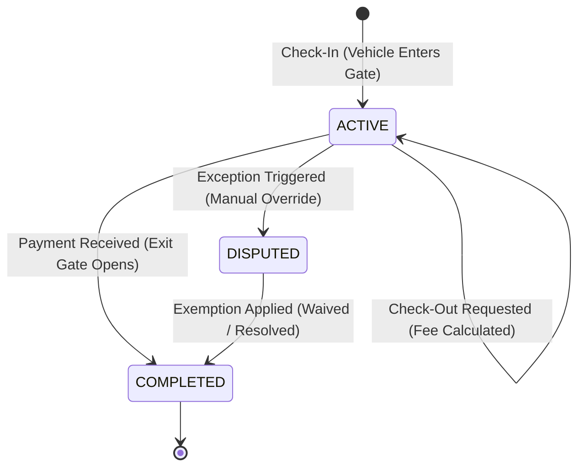

# Parking Session Module Specification
## Project: Parking Building Management System (PBMS)
**Version:** 1.0.0  
**Stack Integration:** Node.js, Express.js, Supabase PostgreSQL, Transaction Integrity

---

## 1. Session Lifecycle & Status Transitions

The core of PBMS operations centers around the lifecycle of a vehicle stay:



### 1.1 Custom Enums
*   **`session_status`**: `ACTIVE`, `COMPLETED`, `DISPUTED`.
*   **`payment_status`**: `PENDING`, `PAID`, `WAIVED`.
*   **`payment_method`**: `CASH`, `BANK_TRANSFER`.

---

## 2. API Endpoint Matrix

| HTTP Method | Route Pathway | Required Role | Functionality Description |
| :--- | :--- | :--- | :--- |
| `POST` | `/parking-sessions/check-in` | `STAFF`, `MANAGER` | Registers gate check-in, locks slot, prints ticket. |
| `POST` | `/parking-sessions/check-out` | `STAFF`, `MANAGER` | Triggers check-out, calculates elapsed fee. |
| `POST` | `/parking-sessions/:id/complete` | `STAFF`, `MANAGER` | Receives cash payment, releases slot, completes stay. |
| `GET` | `/parking-sessions` | `STAFF`, `MANAGER`, `ADMIN` | Search active/closed sessions. |
| `GET` | `/parking-sessions/:id` | `STAFF`, `MANAGER`, `ADMIN` | Retrieve session and linked payment details. |
| `POST` | `/parking-sessions/:id/exception`| `STAFF`, `MANAGER` | Record audit override (e.g., lost ticket, plate mismatch). |

---

## 3. Dynamic Fee Billing Calculation

The billing engine queries the active configuration in `pricing_policies` and processes calculations as follows:

```javascript
/**
 * Calculate billing fee based on elapsed minutes and policy rates
 * @param {number} elapsedMinutes - Stay duration in minutes
 * @param {object} policy - Active tariff record details
 * @returns {number} Billed amount (rounded to 2 decimal places)
 */
function calculateFee(elapsedMinutes, policy) {
  const { base_price, hourly_rate, day_cap, grace_period_minutes } = policy;

  // 1) Grace Period Check: Return $0.00 if within free window
  if (elapsedMinutes <= grace_period_minutes) {
    return 0.00;
  }

  // 2) Calculate billable hours (rounded up to nearest hour)
  const billableHours = Math.ceil(elapsedMinutes / 60);

  // 3) Billed amount = Base Price (1st hour) + Hourly Rate (for subsequent hours)
  let amount = parseFloat(base_price);
  if (billableHours > 1) {
    amount += (billableHours - 1) * parseFloat(hourly_rate);
  }

  // 4) Apply Cap: Limit total cost to Day Cap if configured
  if (day_cap && amount > parseFloat(day_cap)) {
    amount = parseFloat(day_cap);
  }

  return Math.max(0, parseFloat(amount.toFixed(2)));
}
```
