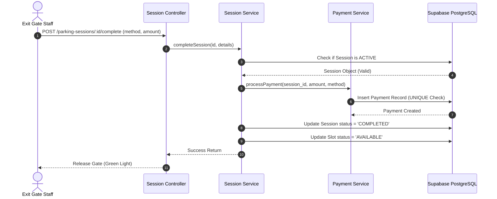

# Payment Module Specification
## Project: Parking Building Management System (PBMS)
**Version:** 1.0.0  
**Stack Integration:** Node.js, Express.js, Supabase PostgreSQL, Financial Audits

---

## 1. Database Model & Integrity Constraints

The billing system records every transaction in the `payments` table to verify cash flows and prevent double-billing.

### 1.1 Unique Constraint for Duplicate Prevention
To prevent recording multiple payments for the same parking stay, we enforce a unique constraint on `payments(session_id)`:
```sql
CREATE TABLE public.payments (
  id uuid PRIMARY KEY DEFAULT gen_random_uuid(),
  session_id uuid NOT NULL UNIQUE REFERENCES public.parking_sessions(id) ON DELETE RESTRICT,
  amount numeric(10,2) NOT NULL CHECK (amount >= 0),
  status payment_status NOT NULL DEFAULT 'PENDING',
  method payment_method NOT NULL DEFAULT 'CASH',
  created_at timestamptz NOT NULL DEFAULT now()
);
```

### 1.2 Custom Enums
*   **`payment_status`**: `PENDING`, `PAID`, `WAIVED`.
*   **`payment_method`**: `CASH`, `BANK_TRANSFER`.

---

## 2. API Endpoint Matrix & Permissions

| HTTP Method | Route Pathway | Required Role | Functionality Description |
| :--- | :--- | :--- | :--- |
| `GET` | `/payments` | `MANAGER`, `ADMIN` | List payments with paging, date filtering, and method search (*Audit Route*). |
| `GET` | `/payments/:id` | `MANAGER`, `ADMIN` | Get detailed payment transaction details. |
| `POST` | `/payments/confirm`| `STAFF`, `MANAGER` | Direct check-out confirmation (invoked inside checkout flow). |

---

## 3. Integration with Stay Closing Flow

When a vehicle arrives at the exit gate:


> [!NOTE]
> If a duplicate payment call is made, step 6 will violate the `UNIQUE(session_id)` database constraint, causing the transaction to rollback instantly and return a `RESOURCE_CONFLICT` error.
