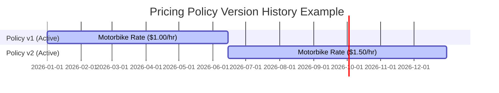

# Pricing Management Module Specification
## Project: Parking Building Management System (PBMS)
**Version:** 1.0.0  
**Stack Integration:** Node.js, Express.js, Supabase client

---

## 1. Temporal Pricing History Design

In parking operations, pricing rules change (e.g., inflation, seasonal adjustments). However, historical parking sessions must retain links to the exact rates applied during their stay.

### 1.1 The Temporal/Snapshot Pattern
We implement a **Soft-History (Temporal Snapshot) Pattern**:
*   Pricing records are never edited in place (`UPDATE`).
*   To update rates, the active policy is deactivated (`is_active = false`).
*   A new pricing policy is inserted (`is_active = true`).
*   `parking_sessions` point to the specific pricing policy instance active at the time.

---

## 2. API Endpoint Matrix & Permissions

| HTTP Method | Route Pathway | Required Role | Functionality Description |
| :--- | :--- | :--- | :--- |
| `GET` | `/pricing-policies` | `STAFF`, `MANAGER`, `ADMIN` | List all pricing policies. Supports filter `?is_active=true`. |
| `GET` | `/pricing-policies/:id`| `STAFF`, `MANAGER`, `ADMIN` | Get details of a specific policy record. |
| `POST` | `/pricing-policies` | `MANAGER`, `ADMIN` | Create new policy (automatically deactivates the old one). |
| `DELETE` | `/pricing-policies/:id`| `ADMIN` | Delete pricing policy (only allowed if it has no session links). |

---

## 3. Example Billing Scenarios (Verification Cases)

### Scenario A: Motorbike Quick Stay (Grace Period Free)
*   **Policy:** Base: $2.00, Hourly: $1.00, Grace: 10 mins.
*   **Stay:** 7 minutes (Check-in 08:00, Check-out 08:07).
*   **Math:** `7 <= 10` (grace).
*   **Charge:** **$0.00**

### Scenario B: Sedan Standard Stay
*   **Policy:** Base: $5.00 (1st hour), Hourly: $3.00, Grace: 15 mins.
*   **Stay:** 145 minutes (Check-in 10:00, Check-out 12:25).
*   **Math:** `145 mins / 60 = 2.4` hours. Round up to `3` billable hours.
    *   1st Hour: $5.00
    *   Subsequent: `2 hours * $3.00 = $6.00`
    *   Total: `$5.00 + $6.00 = $11.00`
*   **Charge:** **$11.00**

### Scenario C: SUV Long Stay (Day Cap Applied)
*   **Policy:** Base: $8.00, Hourly: $5.00, Day Cap: $30.00, Grace: 15 mins.
*   **Stay:** 420 minutes (Check-in 08:00, Check-out 15:00).
*   **Math:** `420 mins / 60 = 7` billable hours.
    *   1st Hour: $8.00
    *   Subsequent: `6 hours * $5.00 = $30.00`
    *   Total Raw: `$8.00 + $30.00 = $38.00`
    *   Day Cap check: `$38.00 > $30.00` limit. Cap applied.
*   **Charge:** **$30.00**
