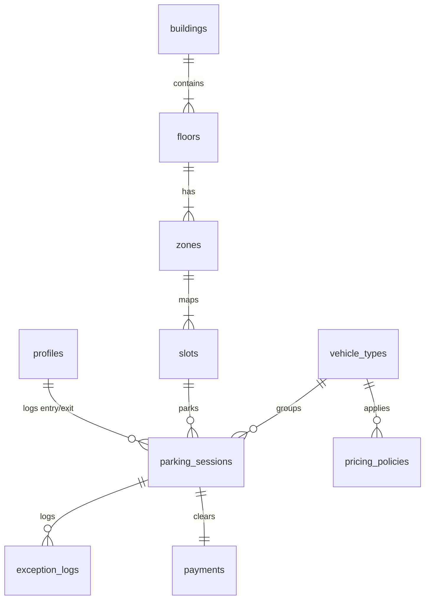

# Database Schema Specification
## Project: Parking Building Management System (PBMS)
**Version:** 1.0.0  
**Target Platform:** Supabase PostgreSQL (v15+)  
**Naming Convention:** Lowercase `snake_case`, pluralized table names, explicit references.

---

## 1. Complete List of Tables

1.  **`profiles`**: Links custom administrative user data (roles, full name) to the Supabase internal `auth.users` table.
2.  **`buildings`**: Represents physical parking buildings.
3.  **`floors`**: Represents floors inside buildings.
4.  **`zones`**: Sub-sections on a floor (e.g., VIP, Charging Zone, Zone A) to partition slots.
5.  **`vehicle_types`**: Master catalog of vehicle categories allowed in the facility.
6.  **`slots`**: Individual parking space records.
7.  **`pricing_policies`**: Configurable tariffs per vehicle type and duration.
8.  **`parking_sessions`**: Main transactional table tracking vehicle stays.
9.  **`payments`**: Financial transactions linked to closed sessions.
10. **`exception_logs`**: Operational overrides (e.g., plate mismatch, lost ticket) requiring explanation.
11. **`audit_logs`**: System activity audit log (created by db triggers) to log sensitive database updates.

---

## 2. PostgreSQL Custom Enums

Create custom types to enforce integrity:

```sql
CREATE TYPE user_role AS ENUM ('ADMIN', 'MANAGER', 'STAFF');
CREATE TYPE slot_status AS ENUM ('AVAILABLE', 'OCCUPIED', 'MAINTENANCE');
CREATE TYPE slot_type AS ENUM ('REGULAR', 'VIP', 'ELECTRIC', 'LARGE');
CREATE TYPE session_status AS ENUM ('ACTIVE', 'COMPLETED', 'DISPUTED');
CREATE TYPE payment_status AS ENUM ('PENDING', 'PAID', 'WAIVED');
CREATE TYPE payment_method AS ENUM ('CASH', 'BANK_TRANSFER');
CREATE TYPE exception_type AS ENUM ('LOST_TICKET', 'PLATE_MISMATCH', 'MANUAL_OVERRIDE');
```

---

## 3. Table Definitions & Columns

### 3.1 Table: `profiles`
*   **Purpose:** Houses user information and RBAC mappings extending Supabase’s built-in Auth.
*   **Columns:**

| Column Name | Data Type | Nullable | Default | Constraints / References |
| :--- | :--- | :---: | :--- | :--- |
| `id` | `uuid` | NOT NULL | - | PRIMARY KEY, references `auth.users.id` |
| `email` | `varchar(255)` | NOT NULL | - | UNIQUE |
| `full_name` | `varchar(100)` | NOT NULL | - | - |
| `role` | `user_role` | NOT NULL | `'STAFF'` | - |
| `is_active` | `boolean` | NOT NULL | `true` | - |
| `created_at` | `timestamptz` | NOT NULL | `now()` | - |

---

### 3.2 Table: `buildings`
*   **Purpose:** Registers active parking garages in the system.
*   **Columns:**

| Column Name | Data Type | Nullable | Default | Constraints / References |
| :--- | :--- | :---: | :--- | :--- |
| `id` | `serial` | NOT NULL | - | PRIMARY KEY |
| `name` | `varchar(100)` | NOT NULL | - | UNIQUE |
| `address` | `text` | YES | `NULL` | - |
| `created_at` | `timestamptz` | NOT NULL | `now()` | - |

---

### 3.3 Table: `floors`
*   **Purpose:** Models floors within buildings to categorize slot levels.
*   **Columns:**

| Column Name | Data Type | Nullable | Default | Constraints / References |
| :--- | :--- | :---: | :--- | :--- |
| `id` | `serial` | NOT NULL | - | PRIMARY KEY |
| `building_id` | `integer` | NOT NULL | - | FOREIGN KEY references `buildings(id)` |
| `floor_number`| `integer` | NOT NULL | - | Unique grouping with `building_id` |
| `floor_name` | `varchar(50)` | YES | `NULL` | e.g. "Basement 1", "Floor 1" |
| `created_at` | `timestamptz` | NOT NULL | `now()` | - |

---

### 3.4 Table: `zones`
*   **Purpose:** Enables partitioning floors into distinct physical areas for cleaner UI map displays.
*   **Columns:**

| Column Name | Data Type | Nullable | Default | Constraints / References |
| :--- | :--- | :---: | :--- | :--- |
| `id` | `serial` | NOT NULL | - | PRIMARY KEY |
| `floor_id` | `integer` | NOT NULL | - | FOREIGN KEY references `floors(id)` |
| `name` | `varchar(50)` | NOT NULL | - | e.g. "Zone A", "VIP Zone" |
| `created_at` | `timestamptz` | NOT NULL | `now()` | - |

---

### 3.5 Table: `vehicle_types`
*   **Purpose:** Simple classification catalog for vehicles to calculate fees.
*   **Columns:**

| Column Name | Data Type | Nullable | Default | Constraints / References |
| :--- | :--- | :---: | :--- | :--- |
| `id` | `serial` | NOT NULL | - | PRIMARY KEY |
| `code` | `varchar(50)` | NOT NULL | - | UNIQUE (e.g. `MOTORBIKE`, `SEDAN`, `SUV`, `TRUCK`) |
| `display_name`| `varchar(100)` | NOT NULL | - | e.g. "SUV / 7-Seat Car" |
| `created_at` | `timestamptz` | NOT NULL | `now()` | - |

---

### 3.6 Table: `slots`
*   **Purpose:** Stores specific parking spots where vehicles reside.
*   **Columns:**

| Column Name | Data Type | Nullable | Default | Constraints / References |
| :--- | :--- | :---: | :--- | :--- |
| `id` | `serial` | NOT NULL | - | PRIMARY KEY |
| `zone_id` | `integer` | NOT NULL | - | FOREIGN KEY references `zones(id)` |
| `slot_code` | `varchar(20)` | NOT NULL | - | Unique naming combined with `zone_id` |
| `type` | `slot_type` | NOT NULL | `'REGULAR'` | VIP, Regular, etc. |
| `status` | `slot_status`| NOT NULL | `'AVAILABLE'` | - |
| `created_at` | `timestamptz` | NOT NULL | `now()` | - |

---

### 3.7 Table: `pricing_policies`
*   **Purpose:** Tariff models configuration defining how much different categories of vehicles are billed.
*   **Columns:**

| Column Name | Data Type | Nullable | Default | Constraints / References |
| :--- | :--- | :---: | :--- | :--- |
| `id` | `serial` | NOT NULL | - | PRIMARY KEY |
| `vehicle_type_id` | `integer` | NOT NULL | - | FOREIGN KEY references `vehicle_types(id)` |
| `base_price` | `numeric(10,2)`| NOT NULL | `0.00` | Rate for initial billable period |
| `hourly_rate` | `numeric(10,2)`| NOT NULL | `0.00` | Cost per hour afterwards |
| `day_cap` | `numeric(10,2)`| YES | `NULL` | Maximum charge inside 24 hours |
| `grace_period_minutes` | `integer` | NOT NULL | `10` | Free exit window |
| `is_active` | `boolean` | NOT NULL | `true` | - |
| `created_at` | `timestamptz` | NOT NULL | `now()` | - |

---

### 3.8 Table: `parking_sessions`
*   **Purpose:** Main active log tracking cars in and out.
*   **Columns:**

| Column Name | Data Type | Nullable | Default | Constraints / References |
| :--- | :--- | :---: | :--- | :--- |
| `id` | `uuid` | NOT NULL | `gen_random_uuid()` | PRIMARY KEY |
| `slot_id` | `integer` | NOT NULL | - | FOREIGN KEY references `slots(id)` |
| `vehicle_type_id` | `integer` | NOT NULL | - | FOREIGN KEY references `vehicle_types(id)` |
| `ticket_code` | `varchar(50)` | NOT NULL | - | UNIQUE |
| `license_plate` | `varchar(20)` | NOT NULL | - | - |
| `check_in_time` | `timestamptz` | NOT NULL | `now()` | - |
| `check_out_time`| `timestamptz` | YES | `NULL` | - |
| `check_in_staff_id` | `uuid` | NOT NULL | - | FOREIGN KEY references `profiles(id)` |
| `check_out_staff_id`| `uuid` | YES | `NULL` | FOREIGN KEY references `profiles(id)` |
| `status` | `session_status` | NOT NULL | `'ACTIVE'` | - |
| `created_at` | `timestamptz` | NOT NULL | `now()` | - |

---

### 3.9 Table: `payments`
*   **Purpose:** Financial audits linking closed sessions to receipts.
*   **Columns:**

| Column Name | Data Type | Nullable | Default | Constraints / References |
| :--- | :--- | :---: | :--- | :--- |
| `id` | `uuid` | NOT NULL | `gen_random_uuid()` | PRIMARY KEY |
| `session_id` | `uuid` | NOT NULL | - | FOREIGN KEY references `parking_sessions(id)` |
| `amount` | `numeric(10,2)`| NOT NULL | - | Total cash value billed |
| `status` | `payment_status` | NOT NULL | `'PENDING'`| - |
| `method` | `payment_method` | YES | `NULL` | CASH, BANK_TRANSFER |
| `created_at` | `timestamptz` | NOT NULL | `now()` | - |

---

### 3.10 Table: `exception_logs`
*   **Purpose:** Logs structural bypass occurrences.
*   **Columns:**

| Column Name | Data Type | Nullable | Default | Constraints / References |
| :--- | :--- | :---: | :--- | :--- |
| `id` | `serial` | NOT NULL | - | PRIMARY KEY |
| `session_id` | `uuid` | NOT NULL | - | FOREIGN KEY references `parking_sessions(id)` |
| `staff_id` | `uuid` | NOT NULL | - | FOREIGN KEY references `profiles(id)` |
| `exception_type`| `exception_type`| NOT NULL| - | LOST_TICKET, PLATE_MISMATCH, etc. |
| `justification` | `text` | NOT NULL | - | Staff input rationale |
| `created_at` | `timestamptz` | NOT NULL | `now()` | - |

---

### 3.11 Table: `audit_logs`
*   **Purpose:** Tracks record operations on profiles, pricing, or sessions to detect malicious manipulation.
*   **Columns:**

| Column Name | Data Type | Nullable | Default | Constraints / References |
| :--- | :--- | :---: | :--- | :--- |
| `id` | `serial` | NOT NULL | - | PRIMARY KEY |
| `table_name` | `varchar(100)`| NOT NULL | - | - |
| `action` | `varchar(20)` | NOT NULL | - | INSERT, UPDATE, DELETE |
| `record_id` | `varchar(100)`| NOT NULL | - | Target record ID reference |
| `old_data` | `jsonb` | YES | `NULL` | - |
| `new_data` | `jsonb` | YES | `NULL` | - |
| `performed_by` | `varchar(100)`| YES | `NULL` | Auth user name or email |
| `created_at` | `timestamptz` | NOT NULL | `now()` | - |

---

## 4. Key Relationships & Constraints



### Unique Key Constraints
1.  **`profiles(email)`**: Enforces unique system emails.
2.  **`floors(building_id, floor_number)`**: Avoids duplicate floor values (e.g., two "Floor 1" entries) in the same building.
3.  **`zones(floor_id, name)`**: Prevents duplicate zones on a floor.
4.  **`slots(zone_id, slot_code)`**: Ensures slot identifiers (e.g., `A-01`) are unique within their specific zones.
5.  **`parking_sessions(ticket_code)`**: Avoids ticket reference duplication.

---

## 5. Index Recommendations

Index columns that undergo frequent search filtration (`WHERE`), table joins (`JOIN`), or sorting (`ORDER BY`) to ensure high database performance:

```sql
-- Fast lookup of user profiles
CREATE INDEX idx_profiles_role ON profiles(role);

-- Navigation tree joins
CREATE INDEX idx_floors_building ON floors(building_id);
CREATE INDEX idx_zones_floor ON zones(floor_id);
CREATE INDEX idx_slots_zone_status ON slots(zone_id, status);

-- Active session optimization (Core Operational Flow)
CREATE INDEX idx_sessions_ticket ON parking_sessions(ticket_code) WHERE status = 'ACTIVE';
CREATE INDEX idx_sessions_plate ON parking_sessions(license_plate) WHERE status = 'ACTIVE';
CREATE INDEX idx_sessions_slot_active ON parking_sessions(slot_id) WHERE status = 'ACTIVE';

-- Analytics & Financial Reports querying
CREATE INDEX idx_sessions_checkout_time ON parking_sessions(check_out_time);
CREATE INDEX idx_payments_session ON payments(session_id);
```

---

## 6. Seed Data Suggestions

A set of baseline configuration data to quickly bootstrap the database during local setup or deployment:

```sql
-- Seed Vehicle Types
INSERT INTO vehicle_types (code, display_name) VALUES
('MOTORBIKE', 'Motorbike'),
('CAR_4SEAT', 'Sedan / Hatchback (4-5 Seats)'),
('CAR_7SEAT', 'SUV / MPV (7 Seats)'),
('TRUCK', 'Light Cargo Truck');

-- Seed pricing policies
INSERT INTO pricing_policies (vehicle_type_id, base_price, hourly_rate, day_cap, grace_period_minutes) VALUES
(1, 2.00, 1.00, 10.00, 10), -- Motorbike: $2.00 first hour, $1.00/hr extra, $10.00 cap
(2, 5.00, 3.00, 30.00, 15), -- 4-Seat: $5.00 first hour, $3.00/hr extra, $30.00 cap
(3, 8.00, 5.00, 50.00, 15), -- 7-Seat: $8.00 first hour, $5.00/hr extra, $50.00 cap
(4, 15.00, 10.00, 100.00, 15);-- Truck: $15.00 first hour, $10.00/hr extra, $100.00 cap

-- Seed physical infrastructure
INSERT INTO buildings (name, address) VALUES 
('Main Parking Garage', '123 Capstone Avenue');

INSERT INTO floors (building_id, floor_number, floor_name) VALUES
(1, -1, 'Basement Floor'),
(1, 1, 'Ground Floor');

INSERT INTO zones (floor_id, name) VALUES
(1, 'Zone B-VIP'), -- Basement VIP
(2, 'Zone A-Regular'); -- Ground Floor Regular

-- Seed default slots (Basement VIP)
INSERT INTO slots (zone_id, slot_code, type, status) VALUES
(1, 'V-101', 'VIP', 'AVAILABLE'),
(1, 'V-102', 'VIP', 'AVAILABLE'),
(1, 'E-101', 'ELECTRIC', 'AVAILABLE');

-- Seed default slots (Ground Regular)
INSERT INTO slots (zone_id, slot_code, type, status) VALUES
(2, 'A-201', 'REGULAR', 'AVAILABLE'),
(2, 'A-202', 'REGULAR', 'AVAILABLE'),
(2, 'L-201', 'LARGE', 'AVAILABLE');
```

---

## 7. Supabase Implementation & Security Guidelines

### 7.1 Automatic Profile Linkage (Triggers)
When registering users via Supabase Auth, write a PostgreSQL database trigger to automatically copy metadata details to your public `profiles` table:

```sql
-- Trigger Function
CREATE OR REPLACE FUNCTION public.handle_new_user()
RETURNS trigger AS $$
BEGIN
  INSERT INTO public.profiles (id, email, full_name, role, is_active)
  VALUES (
    new.id,
    new.email,
    COALESCE(new.raw_user_meta_data->>'full_name', 'Unnamed Staff'),
    COALESCE((new.raw_user_meta_data->>'role')::user_role, 'STAFF'::user_role),
    true
  );
  RETURN new;
END;
$$ LANGUAGE plpgsql SECURITY DEFINER;

-- Trigger Registration
CREATE OR REPLACE TRIGGER on_auth_user_created
  AFTER INSERT ON auth.users
  FOR EACH ROW EXECUTE FUNCTION public.handle_new_user();
```

### 7.2 Row-Level Security (RLS) Policies
Enable RLS on all tables to lock down database access from the client side:

1.  **Enable RLS globally:**
    ```sql
    ALTER TABLE public.profiles ENABLE ROW LEVEL SECURITY;
    ALTER TABLE public.parking_sessions ENABLE ROW LEVEL SECURITY;
    ALTER TABLE public.pricing_policies ENABLE ROW LEVEL SECURITY;
    ```

2.  **Define Policies:**

    *   **Rule 1: Profile Reading:** All active authenticated users can view profiles, but only users with the `ADMIN` role can create/update profiles.
    ```sql
    CREATE POLICY "Allow authenticated read of profiles"
      ON public.profiles FOR SELECT
      TO authenticated
      USING (true);

    CREATE POLICY "Allow admin full access to profiles"
      ON public.profiles FOR ALL
      TO authenticated
      USING (auth.jwt()->>'role' = 'ADMIN');
    ```

    *   **Rule 2: Sessions Management:** Managers and Staff can read and write sessions, but delete actions are blocked.
    ```sql
    CREATE POLICY "Staff and Managers can manage sessions"
      ON public.parking_sessions FOR ALL
      TO authenticated
      USING (
        (SELECT role FROM public.profiles WHERE id = auth.uid()) IN ('STAFF', 'MANAGER')
      );
    ```

    *   **Rule 3: Pricing Updates:** Managers and Admins can write pricing policies; Staff can only read them.
    ```sql
    CREATE POLICY "Staff can read pricing"
      ON public.pricing_policies FOR SELECT
      TO authenticated
      USING (true);

    CREATE POLICY "Managers and Admins modify pricing"
      ON public.pricing_policies FOR ALL
      TO authenticated
      USING (
        (SELECT role FROM public.profiles WHERE id = auth.uid()) IN ('MANAGER', 'ADMIN')
      );
    ```

### 7.3 Real-Time Configuration
Make sure to subscribe to tables that drive the UI map grid dynamically. Enable Supabase Realtime replication on the `slots` and `parking_sessions` table:

```sql
alter publication supabase_realtime add table slots;
alter publication supabase_realtime add table parking_sessions;
```
